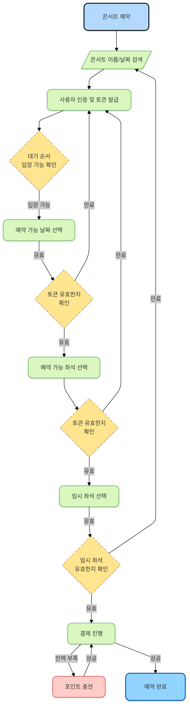
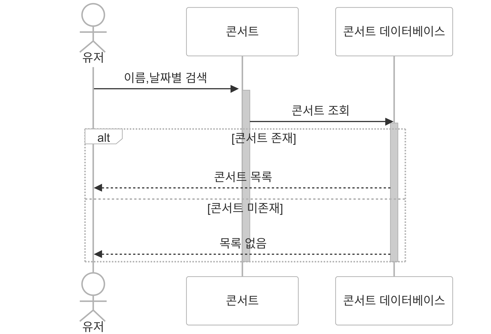
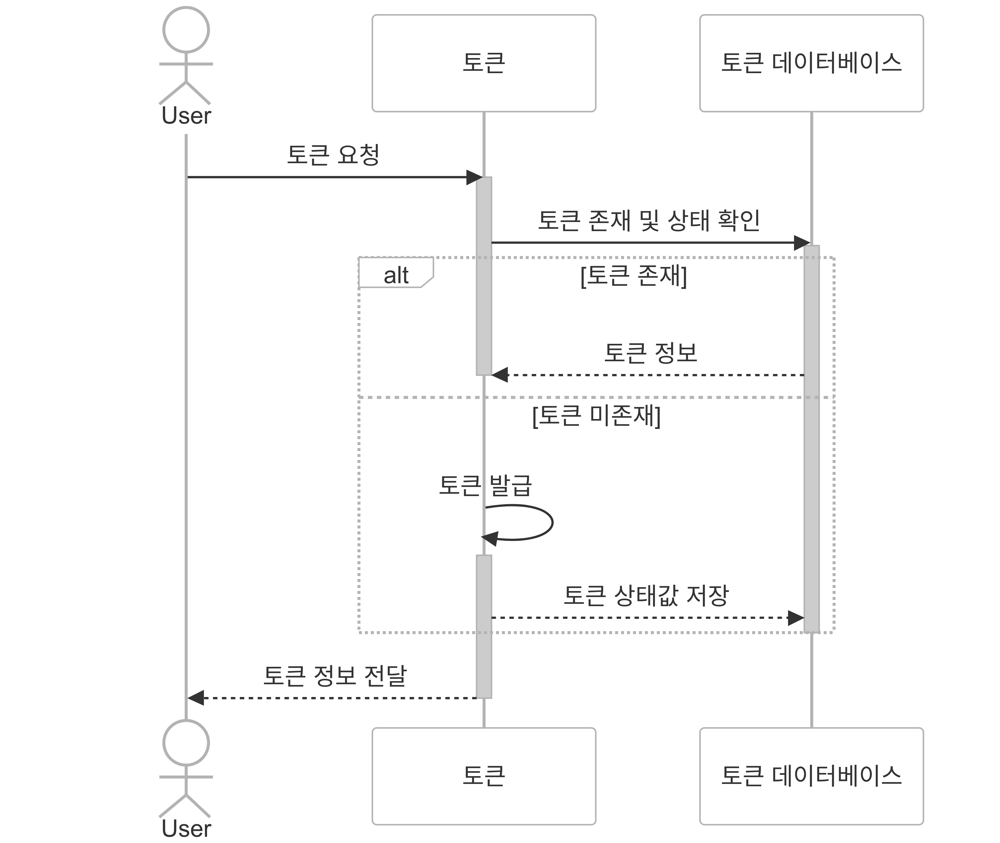
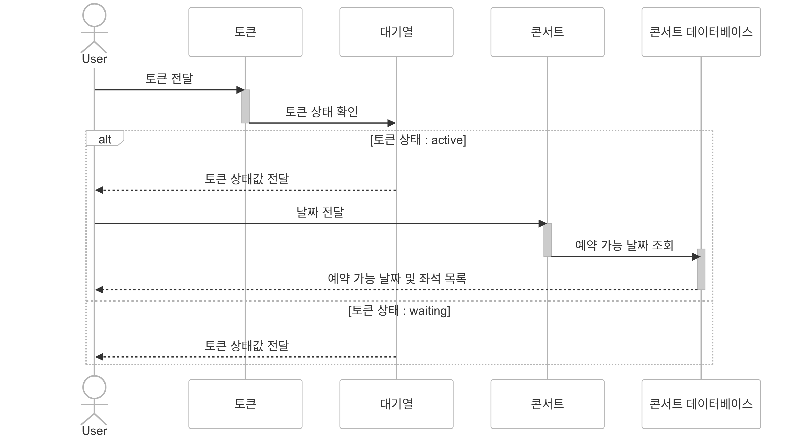
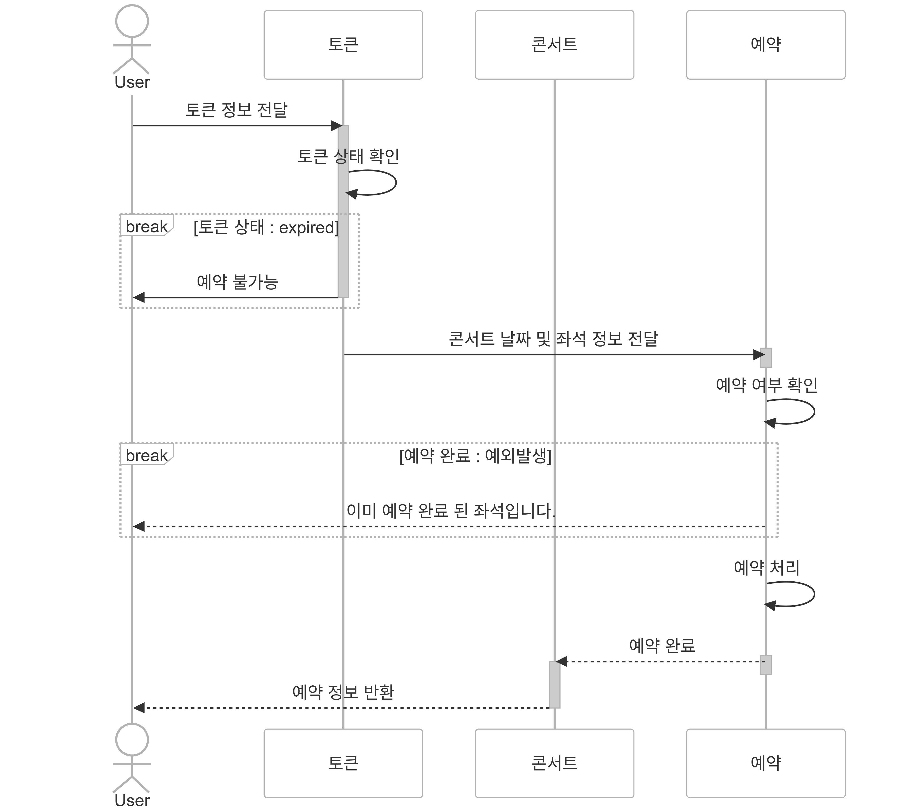
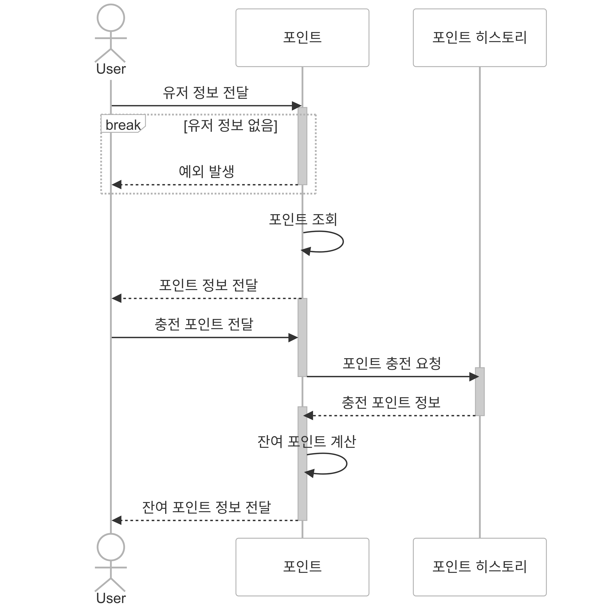
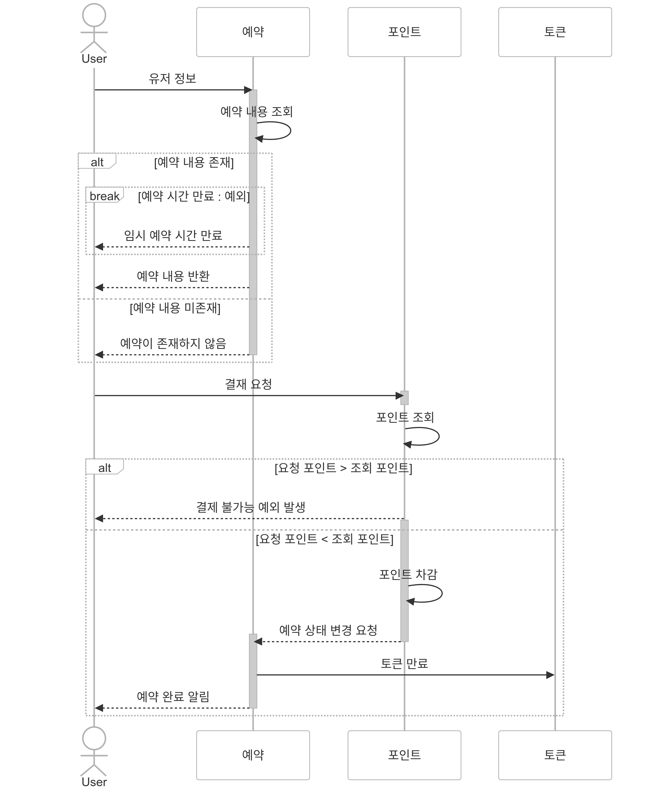
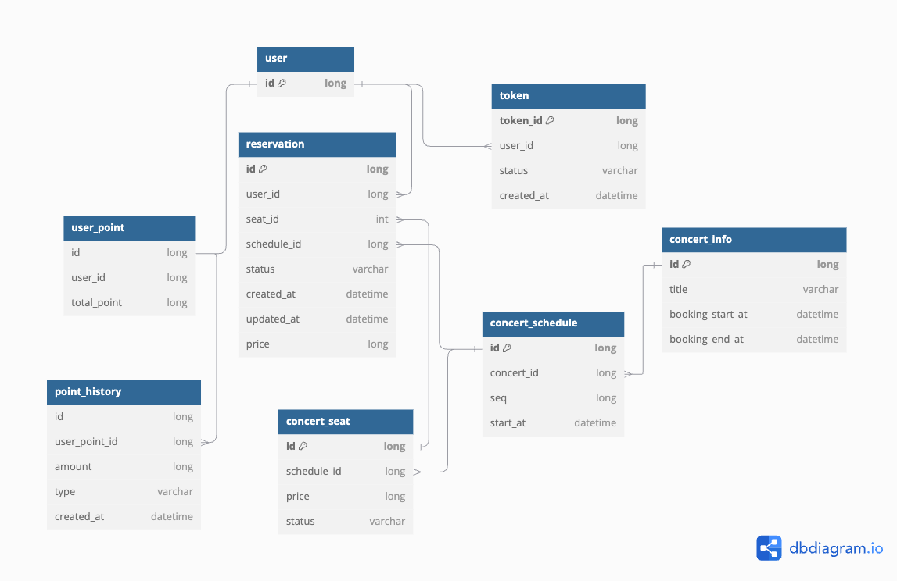

## 플로우 차트
<details>
<summary>콘서트 예약</summary>
<div markdown="1">



</div>
</details>


## 시퀀스 다이어그램
<details>
<summary>콘서트 검색</summary>
<div markdown="1">



</div>
</details>

<details>
<summary>유저 토큰 발급</summary>
<div markdown="1">



</div>
</details>

<details>
<summary>예약 가능한 날짜 및 좌석</summary>
<div markdown="1">



</div>
</details>

<details>
<summary>(임시)좌석 예약 요청</summary>
<div markdown="1">



</div>
</details>

<details>
<summary>잔액 충전 및 조회</summary>
<div markdown="1">



</div>
</details>

<details>
<summary>결제</summary>
<div markdown="1">



</div>
</details>


## erd


- - -

## 패키지 구조

```test
api
├─ common
│  ├─ exception                 
│  └─ response              # api 공통 response 
│  
├─ 도메인                     # point, token, concert 등 도메인 별 패키지
│  ├─ application
│  │   └─ facade
│  │
│  ├─ domain
│  │  ├─ service
│  │  ├─ repository(interface)
│  │  └─ domain
│  │
│  ├─ infrastructure
│  │  ├─ jpaRepository
│  │  └─ repositoryImpl  
│  │
│  └─ presentation  
│     ├─ controller
│     └─ dto
```


