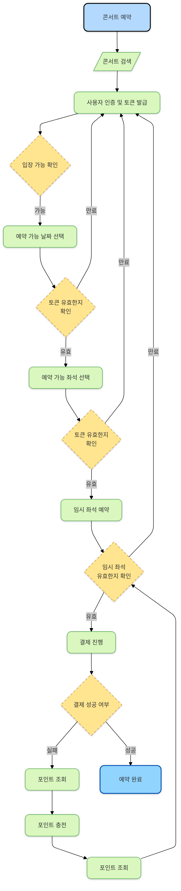
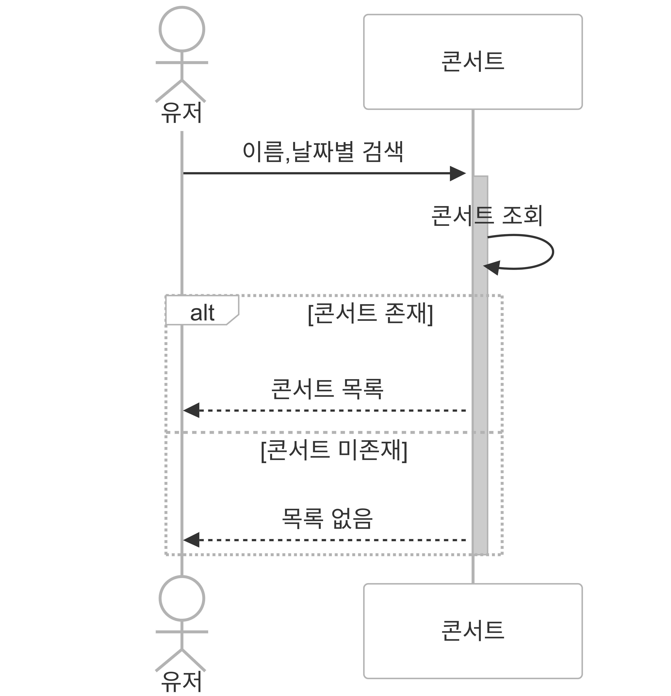
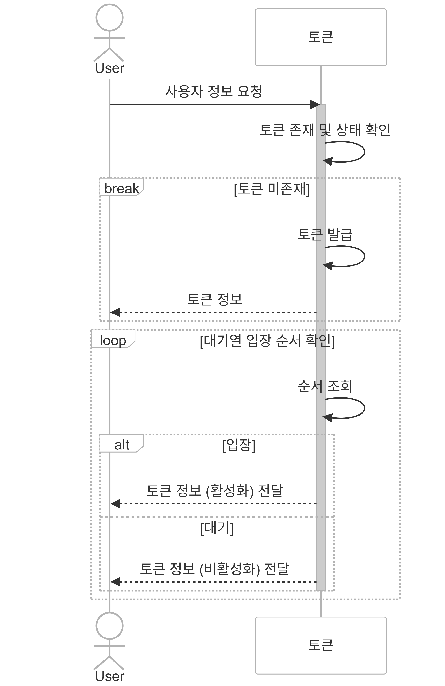
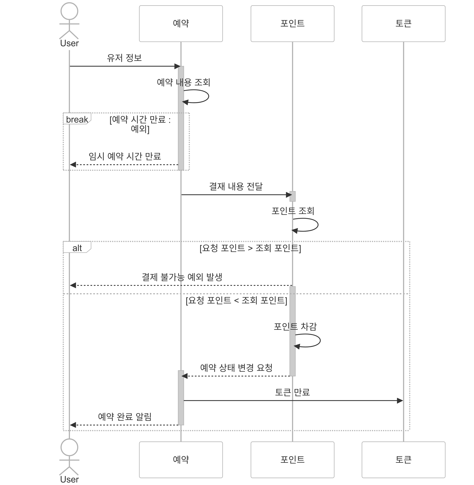
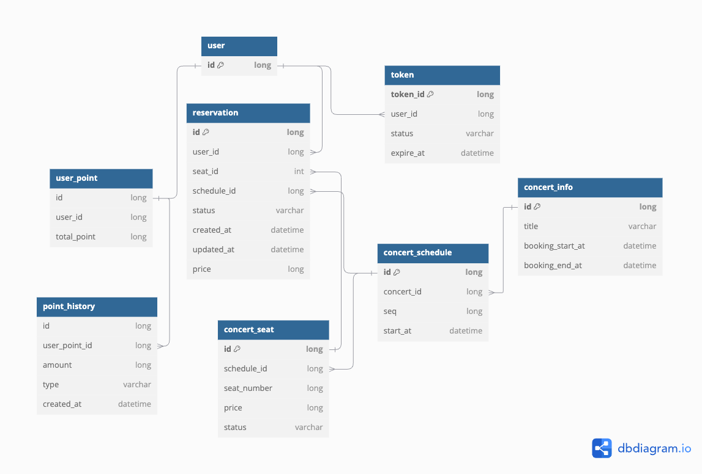

## 플로우 차트
<details>
<summary>콘서트 예약</summary>
<div markdown="1">



</div>
</details>


## 시퀀스 다이어그램
<details>
<summary>콘서트 검색</summary>
<div markdown="1">



</div>
</details>

<details>
<summary>유저 토큰 발급 및 대기열 입장</summary>
<div markdown="1">



</div>
</details>

<details>
<summary>예약 가능한 날짜 및 좌석</summary>
<div markdown="1">


</div>
</details>

<details>
<summary>(임시)좌석 예약 요청</summary>
<div markdown="1">


</div>
</details>

<details>
<summary>잔액 충전 및 조회</summary>
<div markdown="1">


</div>
</details>

<details>
<summary>결제</summary>
<div markdown="1">



</div>
</details>


## erd


- - -

## 패키지 구조

```test
api
├─ common
│  ├─ exception                 
│  └─ response              # api 공통 response 
│  
├─ 도메인                     # point, token, concert 등 도메인 별 패키지
│  ├─ application
│  │   └─ facade
│  │
│  ├─ domain
│  │  ├─ service
│  │  ├─ repository(interface)
│  │  └─ domain
│  │
│  ├─ infrastructure
│  │  ├─ jpaRepository
│  │  └─ repositoryImpl  
│  │
│  └─ presentation  
│     ├─ controller
│     └─ dto

# 지금은 db만을 사용하지만, 추후에 redis 등을 적용 할 것이라고 생각해서 이번엔 infrastructure를 따로 분리했다.
저번 주차 까지는 domain 레벨에서 jpa repository, entity를 그대로 사용해 jpa기술을 활용하도록 노력했고, 이번주차부터는 db와 redis를 분리할 것을 생각하며,
패키지 설계를 했고, infrastructure entity, domain entity를 따로 분리해 사용 할 예정이다.
 
```


