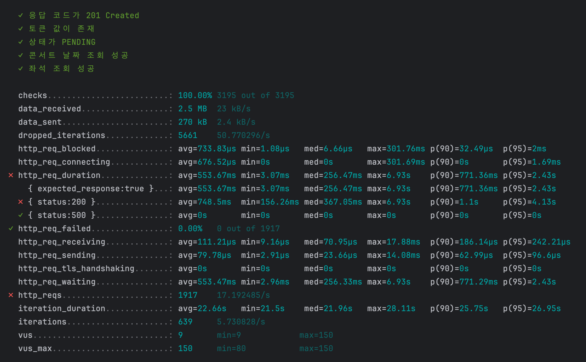
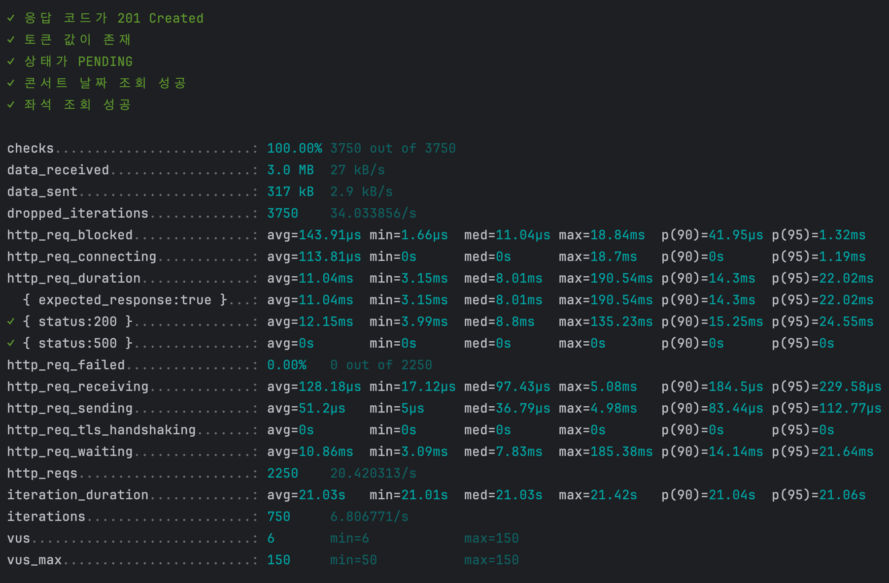
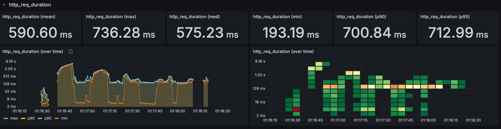
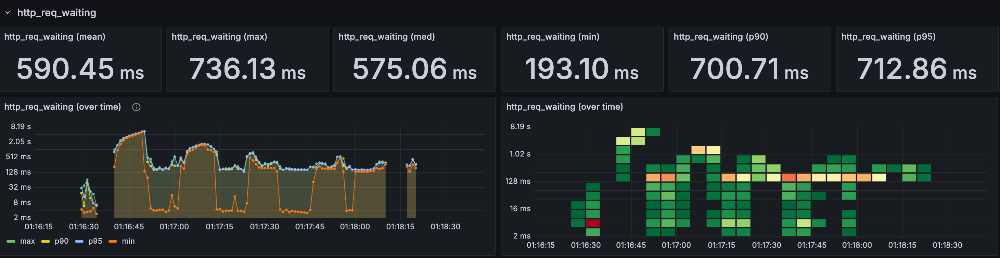
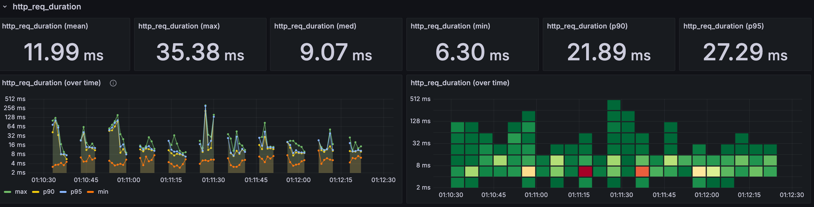
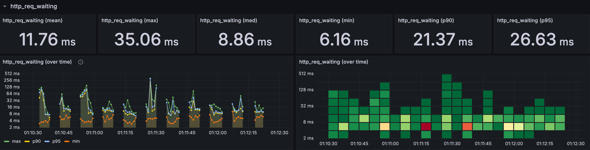

# 부하테스트 시나리오
- - -

## 부하테스트의 목적
### 1. 예상 TPS(Transaction Per Second) 확인

- 시스템이 초당 몇 개의 트랜잭션을 안정적으로 처리할 수 있는지 측정한다.
- 목표 TPS를 설정하고 실제 테스트를 통해 이를 충족하는지 검증한다.
- 부하가 증가할 때 TPS 변동성을 분석하여 확장 가능성을 평가한다.

### 2. 평균/중간/최대 응답 시간(P50, P99, P999) 분석

- 일반적인 사용자가 경험하는 평균(P50) 응답 시간을 측정하여 성능 기준을 검증한다.
- 상위 1% 사용자가 경험하는 P99, 최악의 응답 시간을 나타내는 P999 값을 분석하여 성능 최적화를 위한 기준을 마련한다.
- 특정 요청 유형이나 부하 상황에서 응답 속도가 급격히 증가하는 경우 원인을 분석하고 개선한다.

### 3. 다량의 트래픽 유입 시 동시성 이슈 확인
- 동시 요청이 증가할 때 발생할 수 있는 데이터베이스 커넥션 풀 부족, 스레드 경합, 락 이슈 등을 검토한다.
- 대량의 사용자 요청이 몰리는 상황에서 시스템의 안정성을 확인하고, 부하 분산을 위한 로드 밸런싱, 캐싱, 비동기 처리 전략을 평가한다.
- 예기치 않은 트래픽 급증이나 장기적인 부하 상황에서도 성능이 유지되는지 검증한다.

- - -

## 시나리오

- 토큰 생성 -> 예약 가능한 콘서트 날짜 조회 -> 예약 가능한 좌석 조회

## 부하테스트 스크립트 설명

부하 테스트는 k6를 사용하여 실행되며, 아래 주요 옵션이 포함되어 있다.

### 1. options 설정 설명

- scenarios.concert_reservation:

>
>  - executor: 'constant-arrival-rate' → 일정한 속도로 요청을 발생시킨다.
>  - rate: 50 → 초당 50개의 요청을 보낸다.
>  - duration: '1m30s' → 총 1분 30초 동안 실행한다.
>  - preAllocatedVUs: 50 → 미리 할당된 가상 사용자를 50개 유지한다.
>  - maxVUs: 150 → 최대 가상 사용자 수 150으로 설정한다.
> 

- thresholds (성능 기준):

>
> - http_req_duration: 응답 시간이 P95 기준 1000ms, P99 기준 1500ms 이하 유지한다.
> - http_req_failed: 실패율 0.5% 미만 유지한다.
> - http_reqs: 초당 100개 이상의 요청 유지한다.
> - http_req_duration{status:200}: 정상 응답(P95) 기준 800ms 이하
> - http_req_duration{status:500}: 서버 오류 응답(P95) 기준 2500ms 이하
> 

- ext (외부 모니터링 설정):

>
> - influxdb: 결과를 InfluxDB로 전송하여 Grafana 등에서 시각화가 가능하다.
> - console: 콘솔 로그에 요약 통계를 출력하여 실시간 모니터링이 가능하다.

- - -


## 장애 대응 방법

- 장애 원인 탐색 : 부하 테스트 과정에서 높은 동시 요청으로 인해 데이터베이스 응답 자연이 발생했으며, 이는 인덱스 미적용으로 인한 조회 성능 저하로 확인되었다.
- 대응 방법 :
>
> - DB 인덱스 적용: concert_id 및 scheduleId + status 컬럼에 인덱스를 적용하여 조회 성능을 향상시킨다.
> - 추가적인 장애 대응 계획 : 실시간 모니터링을 통해 부하 급증 시 경고를 설정하고, 필요한 경우 Auto Scaling 적용 검토할 예정이다.
> 


### 인덱스 적용

````

-- concert_schedule 테이블의 concert_id에 단일 인덱스 생성
CREATE INDEX idx_concert_schedule_concert_id
ON concert_schedule (concert_id);

-- concert_seat 테이블의 scheduleId + status 에 복합 인덱스 생성
CREATE INDEX idx_concert_seat_schedule_status
ON concert_seat (schedule_Id, status);

````

- - -

## 인덱스 적용 전후 성능 비교

### 인덱스 적용 전



### 인덱스 적용 후



### 1. HTTP 요청 소요 시간 (http_req_duration)

- 인덱스 적용 전: 평균 553.67ms, 최대 6.93s, P90 771.36ms

- 인덱스 적용 후: 평균 11.04ms, 최대 190.54ms, P90 14.3ms

- 개선점: 평균 응답 시간이 50배 이상 감소하여 대폭적인 성능 향상이 확인된다.

### 2. 서버 응답 대기 시간 (http_req_waiting)

- 인덱스 적용 전: 평균 553.47ms

- 인덱스 적용 후: 평균 10.86ms

- 개선점: 응답 대기 시간이 50배 이상 감소하여 DB 조회 성능이 크게 개선된다.

### 3. 요청 드롭율 (Dropped Iterations)

- 인덱스 적용 전: 5661회 (50.77/s)

- 인덱스 적용 후: 3750회 (34.03/s)

- 개선점: 요청이 드롭되는 횟수가 줄어들며, 시스템의 처리 성능이 안정화된다.

### 4. HTTP 요청 실패율 (http_req_failed)

- 두 경우 모두 0%로 실패 없이 정상적으로 처리된다.

- - -

## 성능 지표

### 1. 인덱스 적용 전 성능 지표





### 2. 인덱스 적용 후 성능 지표




### 3. 성능 분석 및 시스템 병목 탐색

- 부하 테스트를 진행한 결과, 인덱스를 적용한 후 응답 시간이 대폭 감소하고 시스템의 안정성이 향상됨을 확인할 수 있었다.
- 주요 병목 지점은 데이터베이스 조회 시간이었으며, 인덱스를 추가하여 이를 해결했다.


- - -

## 결론

- 인덱스 적용 후 응답 시간이 획기적으로 감소하고 시스템 안정성이 향상된다.

- 특히 http_req_duration과 http_req_waiting의 감소가 DB 인덱싱의 효과를 명확하게 보여준다.

- 인덱스 추가 후에도 지속적인 모니터링을 통해 데이터 증가에 따른 성능 변화를 분석할 필요가 있다.

- 필요할 경우 실행 계획(EXPLAIN PLAN) 을 활용하여 추가적인 최적화 가능성을 검토할 수 있다.


